Notion to Unity is a tool to import Notion databases into scriptable objects so the data can be used in projects. Please note this is a tad experimental, there may be issues or edge cases that are not covered.

- Download databases of any size.
- Apply sorting and filters to data to order it just as it is in a Notion database view.
- Automatic parsing of data into their field types.
- Support for most useful Notion data properties.
- Automatic API key removal on build creation for security.
- System to reference assets in code without a direct inspector reference.

<br/>

## Table of Contents
- [Supported Notion API versions](#supported-notion-api-versions)
- [Supported Notion properties](#supported-notion-properties)
- [Setup guide](#setup-guide)
  - [Notion setup](#notion-setup)
  - [Unity setup](#unity-setup)
    - [Asset creator](#asset-creator)
    - [Filters](#filters)
    - [Sorting properties](#sorting-properties)
    - [Wrapper classes](#wrapper-classes)
    - [Post download logic](#post-download-logic)
    - [Update all assets](#update-all-assets)
- [Scripting](#scripting-api)
  - [Custom Notion database processors](#custom-notion-database-processors)
  - [Accessing Notion data assets](#accessing-notion-data-assets)
  - [Security of secret keys & URLs](#security-of-secret-keys--urls)
- [Example](#example)
- [Support](#support)

<br/>

## Supported Notion API versions
The asset supports both `2025/09/03` & `2022/06/28` API
releases. The only difference between the two is the
`2025/09/03` supports the multiple database data sources
change and is the current API version. It’s recommended to
use the latest version where possible.

> **Note**: Support for multiple data sources is still early days,
> but should work fine as long as the properties are the same on all sources.
<br/>

## Supported Notion properties
Any string convertible type should also support JSON for custom classes, but the mileage may vary. 
Best to just store raw data in these assets and convert the data with an override to the 
PostDataDownloaded() method in the Notion Data Asset.

Note that roll-ups are supported only when they show a property that is otherwise supported below:

| Property type (Notion) | Conversion types supported (Unity)                                                                                           |
|------------------------|:-----------------------------------------------------------------------------------------------------------------------------|
| Title                  | String                                                                                                                       |
| Text                   | - String<br/>- NotionDataWrapper(GameObject(Prefab)/Sprite/AudioClip)<br/>- List/Array of (string, int, float, double, bool) |
| Number                 | - Int<br/>- Float<br/>- Double<br/>- Long<br/>- Short<br/>- Byte<br/>- etc.                                                  |
| Toggle                 | Bool                                                                                                                         |
| Single select          | - String<br/>- Enum                                                                                                          |
| Multi-select           | - List/Array of (string)<br/>- Enum (flags attribute)                                                                        |
| Date                   | SerializableDateTime (Wrapper class for DateTime)                                                                            |
| Rollup                 | Any supported Notion type in this table as the viewed data.                                                                  |
<br/>

## Setup guide

### Notion setup
You need to make an integration in order for the downloading to work. You can make an integration here. The steps to follow are:
- Make a new integration with the New integration button.
- Select the workspace the integrations can access. This should be the workspace the database(s) you want to download are in.
- Give the integration a name & continue to the next page.
- Navigate to the Capabilities tab from the sidebar and ensure the integration has read access. You can disable the rest as you only need the readability.
- Navigate to the Secrets tab and copy the key for use in Unity.

Once done you can then enter Notion and add the integration to one or multiple pages to allow the Notion API to access
the data. This is done from: 
```
... > Manage Connections > .
 ```
Find and add your integration from the options listed. If you don't see the integration you just made listed, close & open Notion and try again.

<br/>

### Unity Setup
In Unity you use a Notion Data Asset to store the data. This
is just a scriptable object which has a custom inspector to
aid with the data download. Each instance you make will
consist of the data asset, a scriptable object class and the
data class which holds the data structure for the data asset
to store. There is a tool to make these for you which can be
found under:
```
Tools > Standalone > Notion Data > Asset Creator
```

<br/>

### Asset creator
The asset creator is an editor window that handles creating
the classes for a `Notion Data Asset`. You just enter a name
for the class you want to make and press `Create` when ready.
You'll be able to see a preview of what the classes will be
called before your press the `Create` button. Once pressed
you'll be able to select where you want to save each newly
generated class. It's best to keep them together in the same
directory for ease of use.

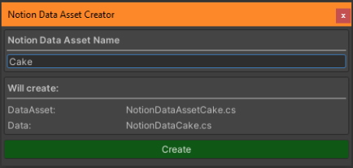

Once set up you'll just need to write your data class to
have the fields you want. An example of a Persona healing
skill data class:

```csharp
[Serializable]
public class DataHealingSkills
{
    [SerializeField] protected string skillName;
    [SerializeField] [TextArea] protected string desc;
    [SerializeField] protected NotionDataWrapperSprite icon;
    [SerializeField] protected SkillType type;
    [SerializeField] protected ActionTarget target;
    [SerializeField] protected SkillCost cost;
    [SerializeField] protected NotionDataWrapperPrefab effect;
    [SerializeField] private float power;
    [SerializeField] private StatusAilment cureAilments;
    [SerializeField] private bool canRevive;
}
```

Then just fill the fields on the data asset (make one from
the `CreateAssetMenu` if you haven't already):
- `Link to database`: Copy and paste the link to the
  database in Notion.
- `API key`: The secret key of your Notion integration to
    use to download data with, as setup earlier.
- `Processor`: Defines how the data is handled in Unity
  once downloaded. You can write custom ones to fit your
  use-cases or use the standard one which will work for
  basic 1-2-1 data where there is no conversion or class
  setup needed. Read more on custom processors [here](#)

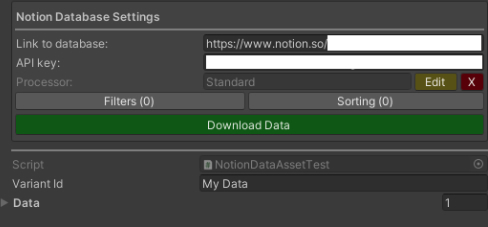

Then press the download button. If all goes well you'll see
a dialogue stating so. If it fails you should see the error
in the console.

<br/>

### Filters
You can apply filters to the download requests by using the
filters window. This window more or less mimic’s Notion’s
filters GUI. This setup supports the property types the
system currently supports reading. The only notable
difference is with rollup support. It is supported, but
you’ll have to use the type the rollup is displaying and
then define it as a rollup of that type for it to work.

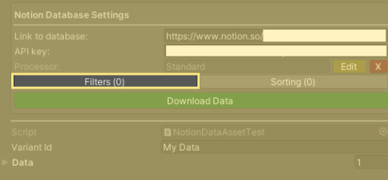

#### Example (Notion)
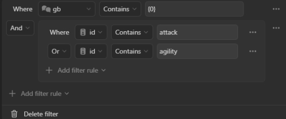

#### Example (Unity)
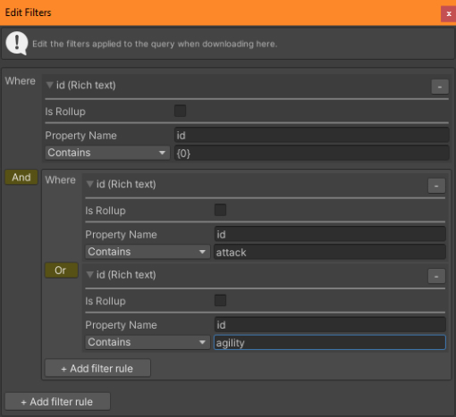

<br/>

### Sorting properties
You can apply sorting properties to your download requests
by adding them to the sort properties list in the inspector.
The text for each entry is the Notion property name you want
to sort by, with the checkbox set to if you want to sort
ascending for that property. The order of the sort
properties in the list defines the order they are used, just
like in Notion

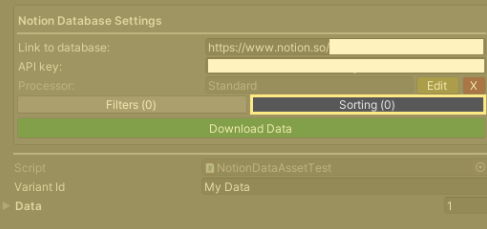

#### Example (Notion)
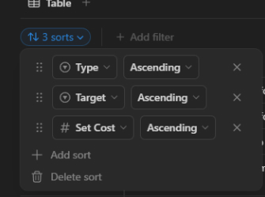

#### Example (Unity)
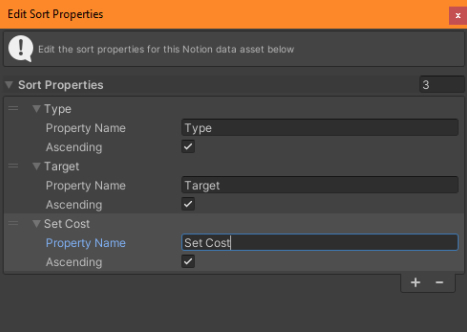

<br/>

### Wrapper classes
Some data needs a wrapper class to assign references. This
is provided for GameObject prefabs, Sprites & AudioClips
should you need it. They are assigned by the name of the
asset when downloading the data. To add your own just make a
new class that inherits from `NotionDataWrapper` and override
the `Assign()` method to parse a string value in Notion into
the desired type in Unity. If the logic to assign the values
uses editor logic make sure you add the `#if UNITY_EDITOR`
scripting define to all editor logic so the project will
compile for builds.

<br/>

### Post download logic
You can also manipulate the data you download after
receiving it by writing an override to the method called
`PostDataDownloaded()` on the `NotionDataAsset`. Note if you
need to run editor logic, make sure it is in a `#ifdef`. 

An example below:

```csharp
#if UNITY_EDITOR
    protected override void PostDataDownloaded()
    {
        skillLookup = new SerializableDictionary<string, DataHealingSkills>();
        
        foreach (vr data in Data)
        {
            // Runs a method called PostDownloadLogic() on the data class intance.
            data.GetType().GetMethod("PostDownloadLogic", BindingFlags.NonPublic | BindingFlags.Instance)
                ?.Invoke(data, null);
            
            // Adds the data class to a lookup for easier use at runtime.
            skillLookup.Add(data.Name, data);
        }
        
        // Saves the changes to the scriptable object.
        UnityEditor.EditorUtility.SetDirty(this);
        UnityEditor.AssetDatabase.SaveAssets();
    }
#endif
```

<br/>

### Update all assets
You can download all data assets in one process through an
additional editor window. The window can be found under:

```
Tools > Carter Games > Standalone > Notion Data > UpdateData
```

The window has the option to halt the downloading of
assets if an error occurs, by default this true. To download
all assets in the project, just press the download button
and wait for the process to complete.

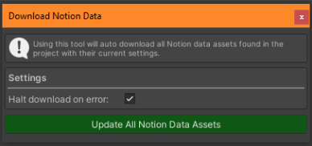

<br/>

## Scripting API

### Assembly
If you are using assemblies for your code base, you’ll need
to reference the notion data assemblies to access the API
of the asset.

| Assemblies |                                  |
|------------|:---------------------------------|
| Editor     | `CarterGames.NotionData.Editor`  |
| Runtime    | `CarterGames.NotionData.Runtime` |

The asset also has some shared libraries between assets. If
you need to access these, you can do so from these
assemblies:

| Assemblies |                                        |
|------------|:---------------------------------------|
| Editor     | `CarterGames.Shared.NotionData.Editor` |
| Runtime    | `CarterGames.Shared.NotionData`        |

<br/>

### Namespace
The main namespace for the asset is: `CarterGames.NotionData`

<br/>

### `NotionDataAccessor`
Handles accessing the scriptable object data assets for this asset.

### Methods

#### `GetAsset()`
Gets the data asset of the defined type. If there is more than one and you don’t define the id it will pick the first one it finds. Will return null if none are found.

```csharp
public static T GetAsset<T>();
public static T GetAsset<T>(string variantId);
```

```csharp
NotionDataAssetMyData dataAsset;

private void OnEnable()
{
    // Gets the first one found.
    dataAsset = NotionDataAccessor.GetAsset<NotionDataAssetMyData>();
    
    // Gets the data asset with the variant id of "MyVariantId".
    dataAsset = NotionDataAccessor.GetAsset<NotionDataAssetMyData>("MyVariantId");
}
```

#### GetAssets()
Gets all the data assets of the defined type that are found in the project. Will return null if none are found.


```csharp
public static List<T> GetAssets<T>();
```

```csharp
List<NotionDataAssetMyData> dataAssets;

private void OnEnable()
{
    // Gets all the found assets of the entered type.
    dataAssets = NotionDataAccessor.GetAssets<DataAssetMyData>();
}
```

<br/>

#### `GetAllAssets()`
Gets all the data assets defined in the index should you need to look through them all.


```csharp
public static List<DataAsset> GetAllAssets();
```

```csharp
List<NdAsset> dataAssets;

private void OnEnable()
{
    // Gets all the assets in the index.
    dataAssets = NotionDataAccessor.GetAllAssets();
}
```

<br/>

### `NotionDataAsset`
Inherit from the make your own Notion data assets to store your Notion data on.

### Properties

#### VariantId
A unique Id that can be used to identify the notion data asset for use with the data access class. By default a random Guid will be used to populate the field. This can be changed in the `NotionDataAsset` inspector in the editor.

```csharp
public string VariantId { get; }
```

<br/>

#### Data
Gets the data stores in the asset for use as a list of the type the asset stores.

```csharp
public List<T> Data { get; }
```

<br/>

### Methods

#### PostDataDownloaded()
Override to run logic post download such as making edits to some data values or assigning others etc.

```csharp
protected virtual void PostDataDownloaded();
```

<br/>

### `NotionDatabaseProcessor`
Inherit from the make your own Notion data assets to store your Notion data on.

### Methods

#### Process()
Implement to alter the method at which data is parser to an asset from the data downloaded from Notion.

```csharp
public abstract List<object> Process<T>(NotionDatabaseQueryResult result) where T : new();
```

<br/>

### `NotionDatabaseQueryResult`
A class that contains the result of a notion database query.

### Properties

#### Rows
The rows downloaded from notion for use.

```csharp
public List<NotionDatabaseRow> Rows { get; }
```

<br/>

### `NotionDatabaseRow`

### Properties

#### Rows
A lookup of all the entries stored in the row that were valid.

```csharp
public SerializableDictionary<string, NotionProperty> DataLookup { get; }
```

<br/>

### `NotionProperty`
An abstract class to handle data as if it were a notion property when downloaded.

### Properties

#### PropertyName
The name of the property in Notion without being forced to a lower string.

```csharp
public string PropertyName { get; }
```

<br/>

#### JsonValue
The JSON value of the value this property holds.

```csharp
public abstract string JsonValue { get; }
```

<br/>

#### DownloadText
The raw download Json in-case it is needed.

```csharp
public abstract string DownloadText { get; }
```

<br/>

### Methods
Most here are to convert the abstract class to one of its variants for easy reading.

#### CheckBox()
Converts this data to a checkbox property.

```csharp
public NotionPropertyCheckbox CheckBox();
```

<br/>

#### Date()
Converts this data to a date property.

```csharp
public NotionPropertyDate Date();
```

<br/>

#### MultiSelect()
Converts this data to a multi-select property.

```csharp
public NotionPropertyMultiSelect MultiSelect();
```

<br/>

#### Select()
Converts this data to a select property.

```csharp
public NotionPropertySelect Select();
```

<br/>

#### Status()
Converts this data to a status property.

```csharp
public NotionPropertyStatus Status();
```

<br/>

#### Number()
Converts this data to a number property.

```csharp
public NotionPropertyNumber Number();
```

<br/>

#### RichText()
Converts this data to a rich-text property.

```csharp
public NotionPropertyRichText RichText();
```

<br/>

#### Title()
Converts this data to a title property.

```csharp
public NotionPropertyTitle Title();
```

<br/>

#### Url()
Converts this data to a url property.

```csharp
public NotionPropertyUrl Url();
```

<br/>

#### TryConvertValueToType()
Tries to convert the json value to the entered type.

```csharp
public bool TryConvertValueToType<T>(out T value);
```

<br/>

#### TryConvertValueToFieldType()
Tries to convert the json value to the field entered.

```csharp
public bool TryConvertValueToFieldType(FieldInfo field, object target);
```

<br/>

### `NotionDataWrapper`
A wrapper base class for converting a notion database property into something else.

### Properties

#### Value
The value stored in the wrapper.

```csharp
public T Value { get; }
```

<br/>

### Methods

#### Assign()
Assigns the reference when called.

```csharp
public virtual void Assign();
```

<br/>

### Custom Notion database processors
Processors are what handle converting the data received from
Notion into something we can use in Unity. The standard
processor is always available for use and will attempt to
process each column of the database that was downloaded into
fields that match those column names 1-2-1. For simple
use-cases, this will be enough. If you need extra
functionality or the ability to merge properties into
collections etc you’ll need to make your own processor

#### API explanation

```csharp
/// <summary>
/// A NotionDatabaseParser for converting Notion Data into TextLocalizationData.
/// The standard parser will not work in this workflow.
/// </summary>
[Serializable]
public sealed class NotionDatabaseProcessorTextLocalization : NotionDatabaseProcessor
{
    /// <summary>
    /// Parses the data when called.
    /// </summary>
    /// <param name="result">The result of the download to use.</param>
    /// <returns>The parsed data to set on the asset.</returns>
    public override List<object> Process<T>(NotionDatabaseQueryResult result)
    {
        var list = new List<object>();
        
        foreach (var row in result.Rows)
        {
            var entries = new List<LocalizationEntry<string>>();

            foreach (var k in row.DataLookup.Keys.Where(t => t != "id"))
            {
                var valueData = row.DataLookup[k];
                entries.Add(new LocalizationEntry<string>(row.DataLookup[k].PropertyName, valueData.RichText().Value));
            }
            
            list.Add(new LocalizationData<string>(row.DataLookup["id"].RichText().Value, entries));
        }

        return list;
    }
}
```

A database it could read from:

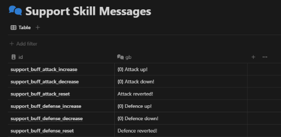

<br/>

### Accessing Notion Data Assets
You can reference the assets as you would a normal scriptable object in the inspector. Or you can use the
`NotionDataAccessor` class in the project to get them via code. Each `NotionDataAsset` has a variant id in the
inspector. By default, the variant id is a new GUID on creation. You can change this to help you identify a single
instance of assets of the same type as another. Some example usage below:

```csharp
private void OnEnable()
{
    // Gets the first asset of the type found.
    var asset = NotionDataAccessor.GetAsset<NotionDataAssetLevels>();
    
    // Gets the first asset of the matching variant id.
    asset = NotionDataAccessor.GetAsset<NotionDataAssetLevels>("MyAssetVariantId");
    
    // Gets all of the assets of the type found.
    asset = NotionDataAccessor.GetAssets<NotionDataAssetLevels>();
}
```

<br/>

### Security of secret keys & URLs
In builds you will not have an issue with these. All urls & keys are removed from the `NotionDataAsset’s` before a build
is made and returned when the build is completed. They will remain in the project if you are using source control which
will be the only case where they are saved otherwise. Keeping the Notion integration to read-only will make it
fairly safe as is.

<br/>

## Example
Below is an example using the system to store data for Persona 5 healing skills for persona's.

### Example (Notion)
A database of all the skills for healing:

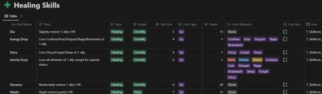

### Example (Unity)
The downloaded data in Unity:

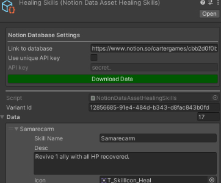

<br/>

## Support

### Need extra help?
If you need additional help with the asset, you can contact me through email. Either directly or via the
contact form on the Carter Games website.

Contact Form: [https://carter.games/contact/](https://carter.games/report/)
<br>
Email: [hello@carter.games](mailto:hello@carter.games)


### Found a bug?
Please report any issues you find to me either via the bug report form on the Carter Games website or through an issue
on GitHub. I’ll try to fix these as soon as I can once they are reported. If I don’t acknowledge your bug report, 
feel free to give me a nudge via email just in-case I haven’t received the notification.

Bug Report Form: [https://carter.games/report/](https://carter.games/report/)
<br>
Github Issues: [https://github.com/CarterGames/NotionToUnity](https://carter.games/report/)
<br>
Email: [hello@carter.games](mailto:hello@carter.games)